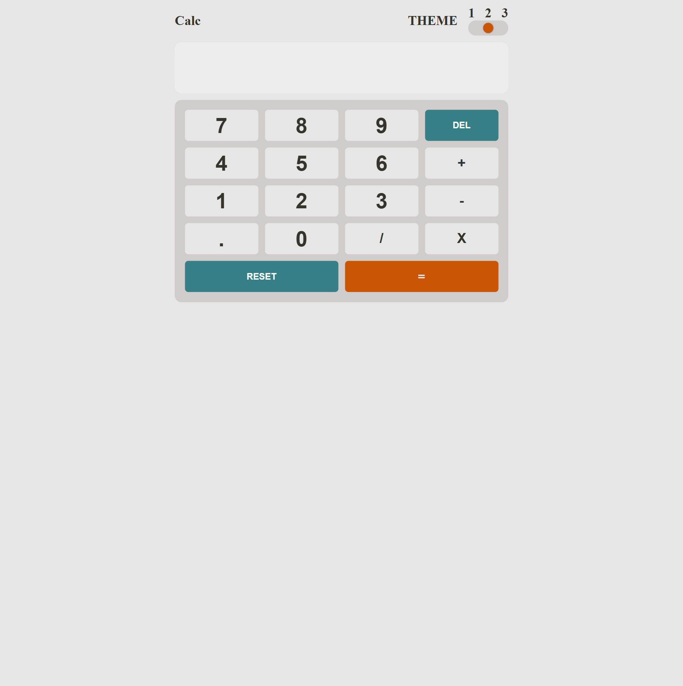

# Frontend Mentor - Calculator app solution

This is a solution to the [Calculator app challenge on Frontend Mentor](https://www.frontendmentor.io/challenges/calculator-app-9lteq5N29). Frontend Mentor challenges help you improve your coding skills by building realistic projects.

## Table of contents

- [Overview](#overview)
  - [The challenge](#the-challenge)
  - [Screenshot](#screenshot)
  - [Links](#links)
- [My process](#my-process)
  - [Built with](#built-with)
  - [What I learned](#what-i-learned)
  - [Continued development](#continued-development)
- [Author](#author)

**Note: Delete this note and update the table of contents based on what sections you keep.**

## Overview

### The challenge

Users should be able to:

- See the size of the elements adjust based on their device's screen size
- Perform mathmatical operations like addition, subtraction, multiplication, and division
- Adjust the color theme based on their preference
- **Bonus**: Have their initial theme preference checked using `prefers-color-scheme` and have any additional changes saved in the browser

### Screenshot


.png>)

### Links

- Solution URL: [Frontend mentor](https://www.frontendmentor.io/solutions/javascript-css-functions-kKQ428RS6R)
- Live Site URL: [Live Site](https://calculator-app-main-bay.vercel.app/)

## My process

### Built with

- Semantic HTML5 markup
- CSS custom properties
- CSS Grid
- Mobile-first workflow

### What I learned

Learnt how to manage multiple themes, and also check properly on load.
for code snippet see below:

```js
window.addEventListener("DOMContentLoaded", () => {
  let theme = 1;
  if (window.matchMedia("(prefers-color-scheme: light)").matches) {
    theme = 2;
  } else if (window.matchMedia("(prefers-color-scheme: dark)").matches) {
    theme = 1;
  }
  themeSlider.value = theme;
  setThemeBySlider(theme);
});
```

### Continued development

To work more on javascript logics.

## Author

- Frontend Mentor - [@Jamieeee1](https://www.frontendmentor.io/profile/Jamieeee1)
- Twitter - [@Meet_JamesB](https://www.twitter.com/Meet_JamesB)
